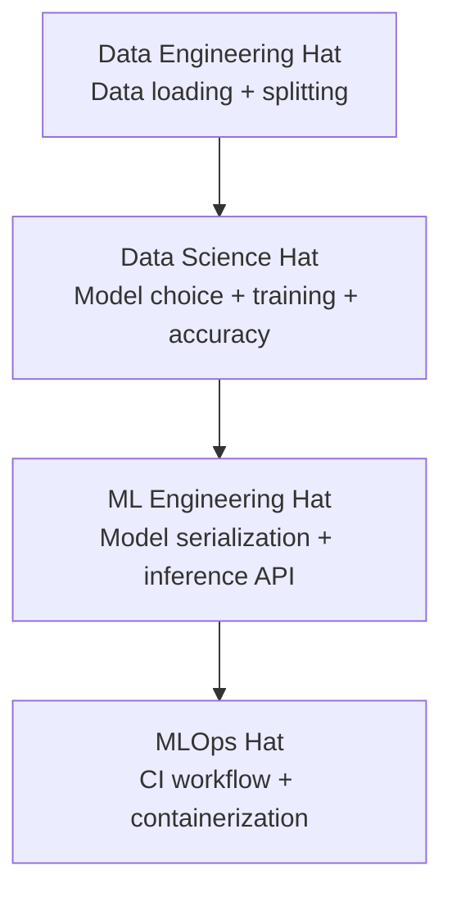
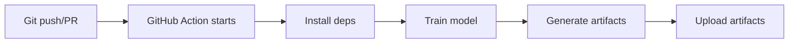
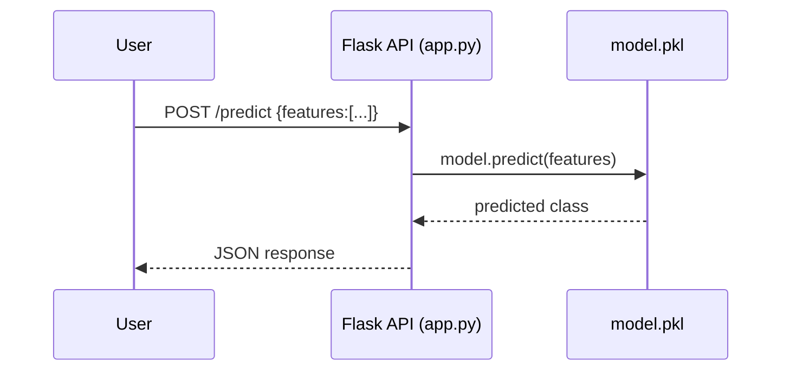
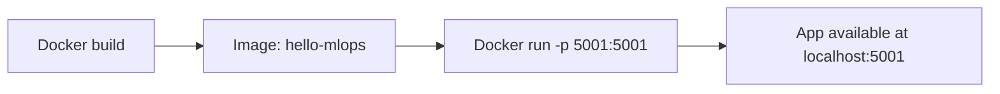

# ML + MLOps Learning Map (This Project)

This note summarizes what you built, why each part matters, and how the pieces connect.

## 1) What You Built

You built a mini end-to-end ML system:

1. Train a classification model (`train.py`)
2. Save model + metrics (`artifacts/model.pkl`, `artifacts/metrics.json`)
3. Serve predictions through an API (`app.py`)
4. Run automation in GitHub Actions (`.github/workflows/ci.yml`)
5. Package and run in Docker (`Dockerfile`)

## 2) The Big Flow

```mermaid
flowchart LR
    A[Dataset: Iris] --> B[Train Model in train.py]
    B --> C[Save model.pkl]
    B --> D[Save metrics.json]
    C --> E[Load model in app.py]
    E --> F[/POST /predict]
    E --> G[/GET /health]
```

## 3) Role Hats You Wore



Notes:

- In this project, the Data Engineering part is lightweight (good for beginner project scope).
- In real companies, Data Engineering usually includes pipelines, warehouses/lakes, validation, and orchestration.

## 4) CI Workflow Logic

Your workflow runs on branch events (for example `dev`) and does:

1. Checkout code
2. Setup Python
3. Install dependencies
4. Run `python train.py`
5. Upload `artifacts/` as workflow artifact



Important:

- Uploading artifacts in CI saves them in the workflow run, not automatically back into your git repo.

## 5) API Serving Path



## 6) Docker Path

- Build image: includes Python, dependencies, app code
- Run container: starts `python app.py`
- Expose port: `5001`



## 7) Common Issues You Already Learned

1. Wrong virtual environment selected:

- Symptom: `Import "numpy/joblib/sklearn" could not be resolved`
- Fix: select and activate `hello-world-mlops/.venv`

2. Port already in use:

- Symptom: `Address already in use` on `5001`
- Fix: stop running container/process or use a different port

3. Dockerfile security badge:

- Usually a vulnerability scanner warning on base image layers
- Not always a code bug in your app

## 8) Interview-Friendly Summary

"In this project I built an end-to-end ML classification service: trained and evaluated a model, packaged model artifacts, exposed inference through a Flask API, automated retraining checks through GitHub Actions, and containerized the service with Docker. This gave me hands-on practice across Data Science, ML Engineering, and MLOps responsibilities."

## 9) Quick Commands Cheat Sheet

```bash
# Train
python train.py

# Run API locally
python app.py

# Health check
curl http://localhost:5001/health

# Predict
curl -X POST http://localhost:5001/predict \
  -H "Content-Type: application/json" \
  -d '{"features":[5.1,3.5,1.4,0.2]}'

# Docker build/run
docker build -t hello-mlops:latest .
docker run --rm -p 5001:5001 hello-mlops:latest
```

---

If you want, next I can add a second file with a 30-day learning roadmap from this project to production-level MLOps.

## 10) Manager-Friendly Project Update (Non-Technical)

### What I Completed So Far

1. Built a working machine learning prototype that can make predictions.
2. Saved the model in a reusable format so it can be used by other systems.
3. Exposed the model through an API so users/services can request predictions.
4. Added automation so model retraining and validation can run on code changes.
5. Containerized the solution with Docker to run consistently across environments.
6. Deployed MLflow on local Kubernetes to practice production-style ML operations.
7. Exposed the deployed MLflow UI through secure port-forwarding (`7001 -> 5000`) and validated live connectivity.

### Why This Matters

- Faster iteration: model updates can be tested and delivered more quickly.
- Better reliability: standard packaging reduces environment-related failures.
- Better traceability: model and workflow changes are easier to track and audit.
- Better scalability readiness: this forms a base for real production deployment.

### Current Goal

Move from a learning prototype to a production-ready MLOps workflow where training, tracking, deployment, and monitoring are automated and repeatable with minimal manual effort.

## 11) MLflow References

- Basic installation: https://community-charts.github.io/docs/charts/mlflow/basic-installation
- PostgreSQL backend installation: https://community-charts.github.io/docs/charts/mlflow/postgresql-backend-installation
